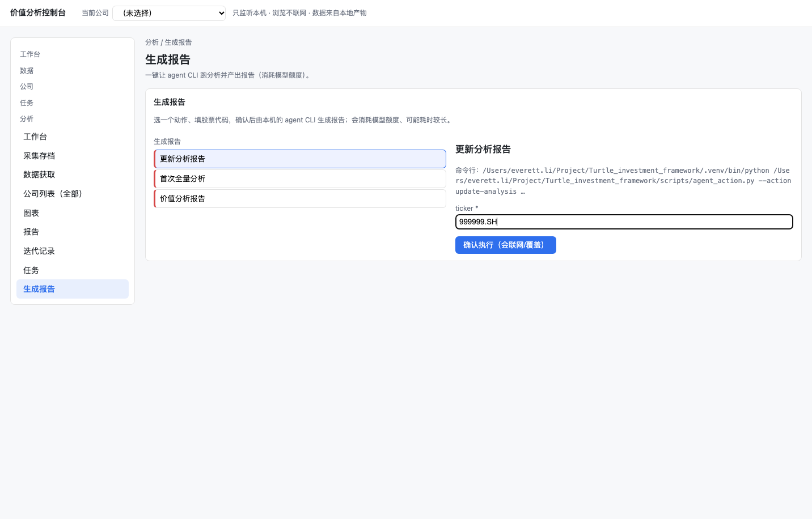
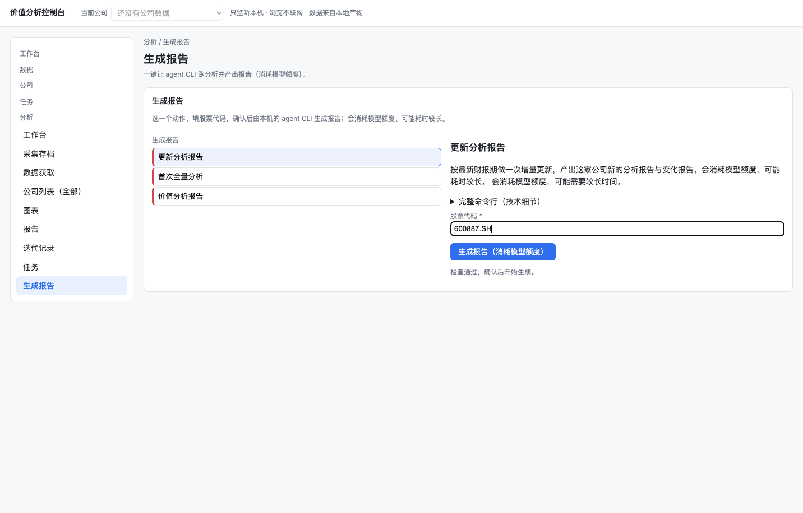
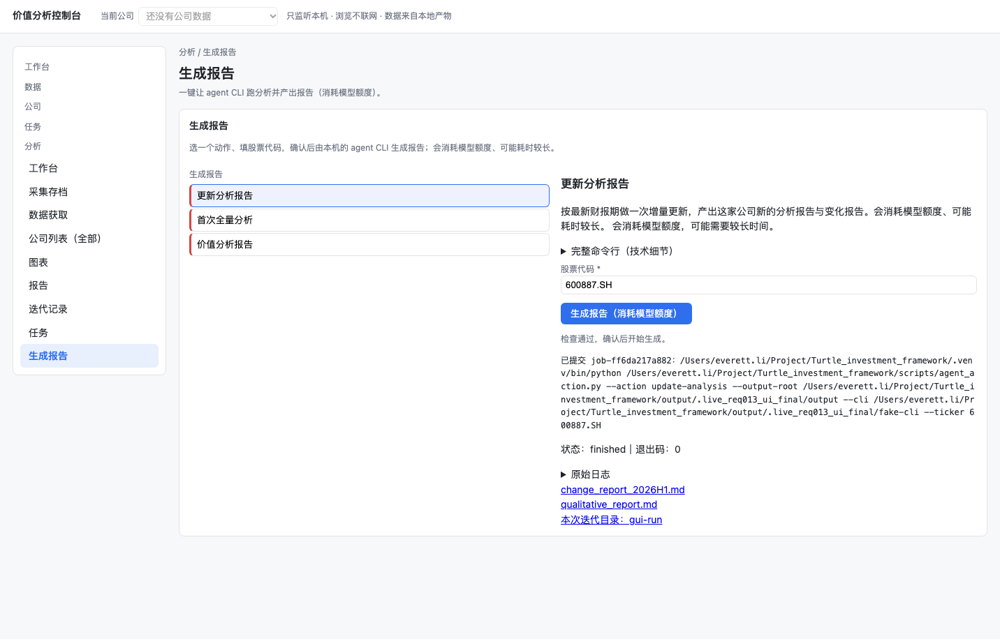
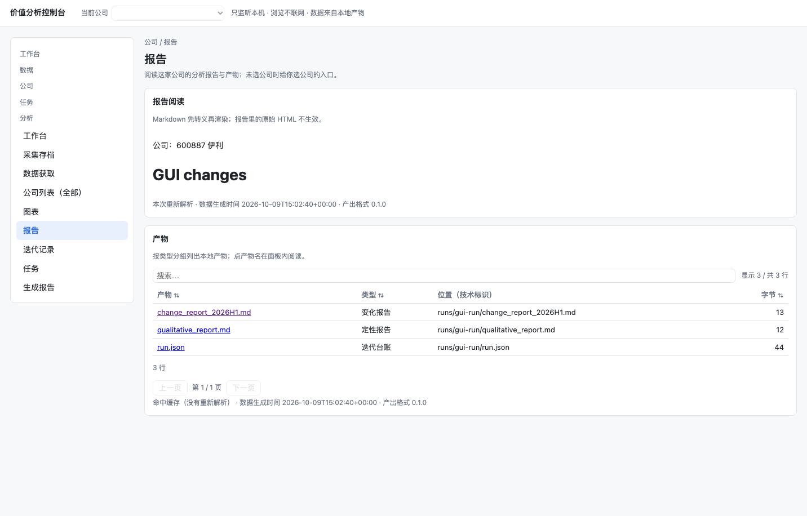
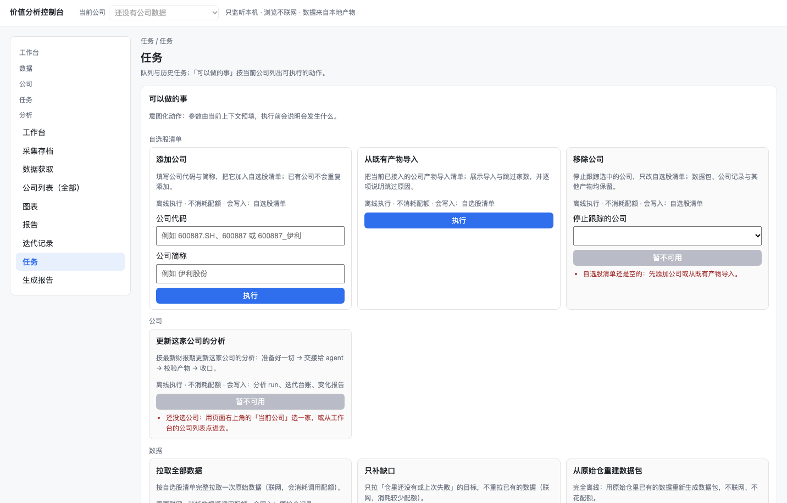

# REQ-013 真实浏览器前后对照（2026-10-09）

环境：macOS，仓库 `.venv/bin/python`，本机 Edge 无头 CDP。修复前基线 main `47b9900`（#77 最小实现已合入）。
修复后使用沙箱公司目录与假 CLI，浏览器真实点击表单、原生确认框和产物链接；此项不替代 AC-8 的真实模型调用。

## 修复前

```bash
WEBUI_ARCHIVE_ROOT=output/.live_req013_archive WEBUI_NO_BROWSER=1 .venv/bin/python -m scripts.webui --port 8873
.venv/bin/python docs/run-records/assets/2026-10-09-REQ-013/before-probe.py output/.live_req013_ui_before
```

退出码 1；`failures`：提交前缺完整的 agent 命令行、选定动作后缺额度告知、目录不匹配时提交仍可用。
走查用相同的动作和标的（更新分析 / 600887.SH，之后替换为不存在的 999999.SH）。



## 修复后

```bash
REQ013_GUI_PORT=8875 REQ013_GUI_ROOT=output/.live_req013_ui_final .venv/bin/python docs/run-records/assets/2026-10-09-REQ-013/fixture-server.py
.venv/bin/python scripts/gui_agent_walkthrough.py --base http://127.0.0.1:8875 --out output/.live_req013_ui_final_evidence --submit
```

退出码 0；真实输出 `{"failures": [], "exit_code": 0}`（完整 observations 共 10 项见附件）。
表单只填写股票代码，额度告知清楚；完整命令可在技术细节中展开；目录缺失时禁用。
拒绝原生确认框不创建任务，接受后恰好创建一个成功任务；三类产物链接出现，真实点击变化报告可阅读。





## 留档

- [修复前 observations](assets/2026-10-09-REQ-013/before-observations.json)
- [修复后 observations](assets/2026-10-09-REQ-013/after-observations.json)
- 修复前探针与沙箱服务配置将作为本记录附件保留；不包含凭据。

## 任务历史刷新

```bash
.venv/bin/python docs/run-records/assets/2026-10-09-REQ-013/history-probe.py
```

真实浏览器打开任务页并刷新，刷新前/后都有三条本次产物链接，退出码 0、failures 为空；
任务记录中保存可恢复的产物解析接口，重启恢复也由同一接口读取。


