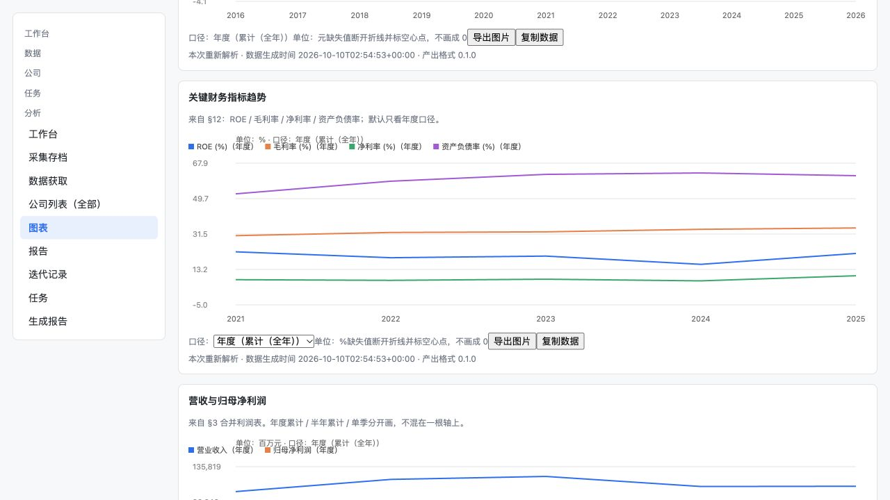
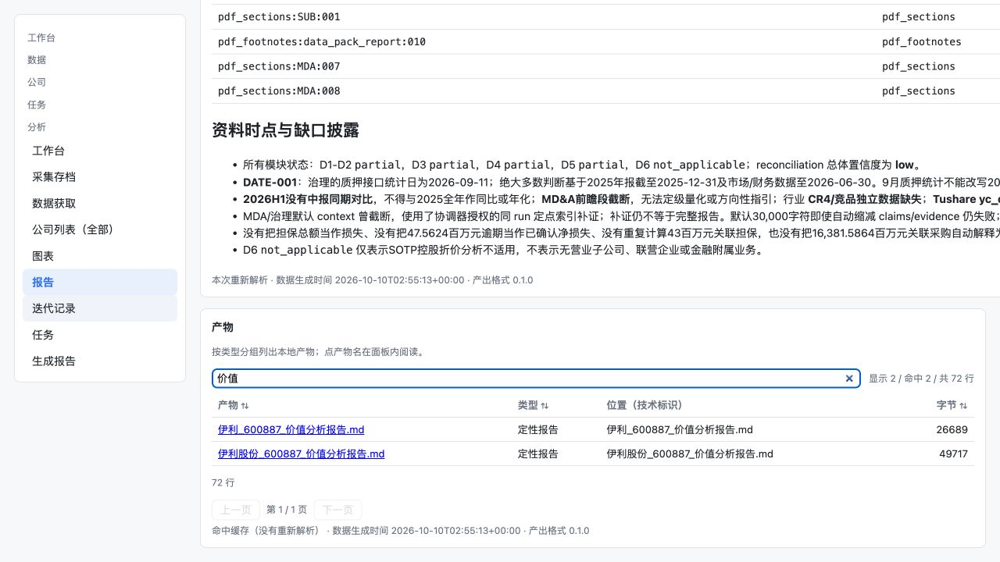
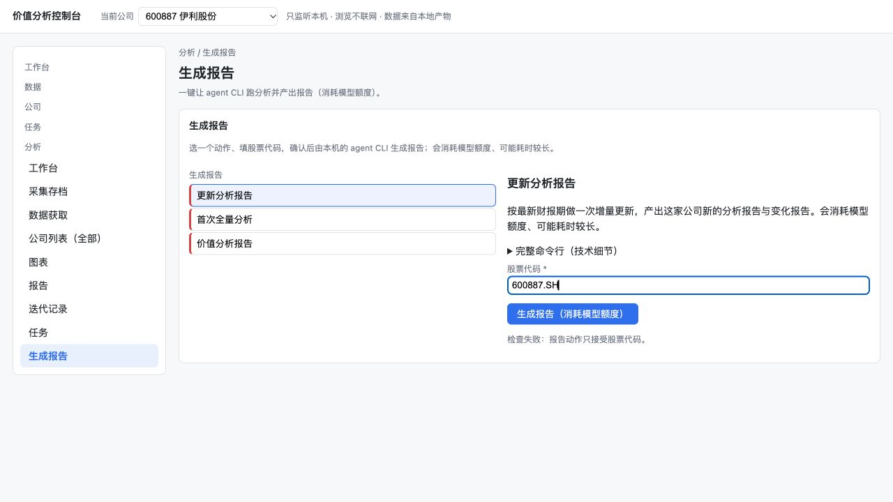
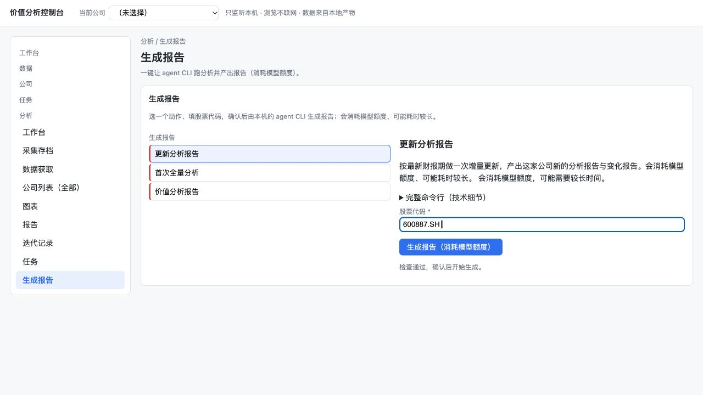
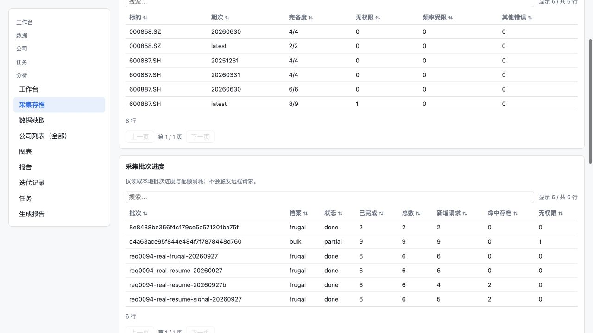

# GUI 用户体验走查 · 2026-10-10

**结论**：当前控制台可以展示产物与执行命令，但公司研究路径存在可复现的阻断与信息断层。
建议登记 P1 提案 REQ-015“公司研究工作区”，追加反馈后五片分别交付标准 K线与估值时间轴、可选 agent/模型、
报告阅读、采集解释与研究导航。既有预检回归先修，不能用新编号替代旧 AC。

**角色与边界**：按 owner 请求由本次 Codex 担任产品经理与 QA；这是提案调查，
不是 REQ-015 的收口验收报告。本次未修改产品代码、测试、既有 AC 或门禁。

## 环境与数据

| 项 | 实际环境 |
|---|---|
| 基线 | 正式 main `88dc97f3f08155b6a1f7b9ca64c40a5230a083c5`；开始时工作区干净 |
| 浏览器 | Codex 内置真实 Chromium 浏览器，截图视口 1280×720 |
| 服务 | 项目 `.venv/bin/python -m scripts.webui`，只监听 `127.0.0.1:8876` |
| 公司产物 | 复制现有 output 的 12 家公司等可见产物至 `output/.live_ux_20261010/output`，保留 mtime |
| 原始仓 | 对真实 `~/turtle_archive/store.db` 用 SQLite `mode=ro` backup 到沙箱；旧存档与批次复制后用正式 import-legacy 导入 |
| 写入 | 缓存、任务、自选股、迁移及真实采集全部落沙箱；未写使用者真实 HOME 存档 |
| 凭据 | 真实 Tushare token 仅从既有 `.env`/环境读取；不记录值；GUI 不输入凭据 |

沙箱 `config.json` 指向该目录下 `output`、`archive`、`cache`，设置 `open_browser=false`、
`port=8876`。这是独立调查实例的正式配置，不是修改产品行为的运行时补丁。
开始在受限环境绑定端口失败（退出 4，Operation not permitted），授权提升后只监听本机成功；
这是测试环境约束，不算 GUI 产品缺陷。

## 实跑记录

```bash
# 配置/副本已按上表准备，项目根执行；真实存档不作为写入目标。
.venv/bin/python -m scripts.webui \
  --config output/.live_ux_20261010/config.json --no-browser

# 将复制过来的既有原始存档迁移到沙箱 DB，不读取真实缓存目录。
.venv/bin/python -m scripts.datalayer import-legacy \
  --store output/.live_ux_20261010/archive \
  --from output/.live_ux_20261010/archive \
  --cache-dir output/.live_ux_20261010/nonexistent-cache

# GUI 只在沙箱清单添加伊利，然后实际验证 2026H1 的缺口。
.venv/bin/python -m scripts.datalayer pull \
  --store output/.live_ux_20261010/archive \
  --ticker 600887.SH --periods 20260630 \
  --profile frugal --only-gaps --yes
```

迁移退出 **0**：导入 29 / 跳过 0 / 冲突 0；明确提示没有旧 collector cache，不绕过错误。
真实采集退出 **0**，真实输出：

```text
只补缺口：8 个目标中 2 个仍需补齐
调用量预估：2 次请求（frugal）
  按档位：frugal 2
  balancesheet      1
  income            1
批次 8e8438be356f4c179ce5c571201ba75f：done；新增请求 2 / 命中存档 0 / 失败 0 / 无权限 0
```

随后真实点击“采集存档”，观察到该批次 **done、2/2、新增请求 2、命中 0、无权限 0**。
这次只补财报两项，**没有重跑**整批全量采集或模型生成。
权限失败/部分成功来自复制的历史真实批次（`yc_cb` 无权限、`partial 9/9`），
不冒称本次刚发生的失败。

## 用户任务与观察

| 场景 | 实际操作/观察 | 产品判断与归属 |
|---|---|---|
| 初次打开 | 首页有 12 家公司；部分行无数据/分析时间却写“正常”；点击伊利进入图表 | 未知信息需要解释，属 REQ-012 维护 M3；新路径由 REQ-015 AC-1承接 |
| 看趋势 | 三张 Canvas 图能显示，年度/半年/单季切换成功，URL 随口径改变；只有口径/导出/复制控件 | 未复现“完全不能画图”；复现探索不足与视觉拥挤，REQ-015.1 |
| 读关键指标 | 单位文字和多项图例非常紧凑；营收/利润共轴；无范围/显隐/缩放/页面数值表 | 不据截图断言坐标值错误或标签一定重叠；新增能力需用数值/视觉任务验收 |
| 找价值报告 | 默认长篇 qualitative_report，产物表位于全文之后；72 个产物，第一页 50 行；搜索“价值”命中两项，均分类为“定性报告” | 分类在 REQ-009 维护 M1；正文前的类型/版本导航属 REQ-015.3 |
| 打开历史 | 点击“伊利_600887_价值分析报告.md”，正文日期为 2026-06-09；列表无日期/正式发布/过期标识 | 证明旧报告可被误选，未声称不存在最新报告；阅读/版本元信息需 REQ-015.3 |
| 生成预检 | 全局伊利→生成报告→更新分析报告→输入600887.SH，仍提示“报告动作只接受股票代码”，按钮禁用 | **P0 回归**，REQ-013 T13；父需求及 .3 回退 in-progress，原 AC不改 |
| 回归反例 | 清除全局公司后重新触发同代码预检，界面显示“检查通过，确认后开始生成” | 差异是全局上下文；未点击确认，也未启动模型分析 |
| 选 agent/模型 | 只有三种报告动作和股票代码字段，无选择控件 | REQ-013 原范围明确排除；新增 REQ-015.2，而非指责旧 AC没完成 |
| 空仓判断 | 开始 DB 无原始记录、自选股空；缺口面板却写“没有缺口：仓里的目标都是 ok/empty” | **P1 文案缺陷**，REQ-012 维护 M1，不能推导为数据齐全 |
| 获取范围 | 沙箱添加伊利、导入真实历史数据后，数据页22/23、1缺口；全量预估49、补缺口预估37 | 已有记录与目标计划分母不同；REQ-012维护 M2先澄清，REQ-015.4按分析范围统一解释 |
| 判断采集结果 | 真实新增批次呈现ID/frugal/done/2/2；旧批次partial/9/9/无权限1；结果行显示ok/empty/no_permission与yc_cb | 完成计数不是成功计数；需要中文业务组、剩余缺口/影响/下一步，REQ-015.4 |

### 预检回归定位

读取项目源码进一步确认：`static/app.js::api()` 在同源请求中统一加入当前 selection，
`plugins/agent_report.py::_preflight()` 又拒绝除 `command/ticker` 外的任何 query。
因此合法页面上下文 `company` 与 agent 预检白名单冲突。真实浏览器“选中→阻断、清除→通过”
提供行为证据；源码解释根因，不替代行为验证。

**建议修复判据**：无公司/合法当前公司/从报告或图表携带 selection 进入三种路径，
相同有效 ticker 均预检通过；非法业务参数仍拒绝且零分析进程。保留服务端校验，不能直接取消白名单。

## 截图证据

**图表现状**：能绘制和切换，但信息紧凑、缺少探索入口。



**版本查找**：产物在长报告末尾，两个价值报告均显示“定性报告”。



**预检失败**：全局公司已选且 ticker 合法。



**对照**：清除全局公司，重新输入同一合法 ticker，通过预检。该对照是诊断证据，未改产品。



**真实批次结果**：本次2/2与旧partial批次均可读到，但未解释业务影响。



其余屏幕保留在同目录：默认报告、旧价值报告、首次生成表单、空仓数据页和导入后存储概览。
完整 AX 文本含报告内容，只留沙箱，不纳入需求文档。

## QA 覆盖边界与落地

- 本次实跑覆盖 GUI 阅读/切换/筛选/预检、沙箱添加自选股、正式旧仓迁移及真实采集结果。
- 未测试真实模型生成、取消/恢复新采集任务、两个规定桌面视口或新能力；它们是后续 AC，
  不能由本次已测结果推导通过。没有执行投资交易或编辑既有报告。
- REQ-013 T13：预检回归，父/.3 状态回退并同步台账/索引；修复后按原 AC 重新验收。
- REQ-009 M1 与 REQ-012 M1～M4：分类、空仓/完备度/未知状态与导航分组缺陷当次登记。
- REQ-015 五片仅 proposed，未接受、未实施。Issue 发布被自动审批拒绝，
  本地草案留在 [Issue 草案](2026-10-10-REQ-015-issue-draft.md)，待 owner 明确批准。
- 文档门禁：授权允许测试绑定本机环回端口后，完整 `make verify` **退出 0**：
  **1903 passed / 3 skipped / 覆盖率 76.60%**，追溯 **18 passed**，scope **48 文件/1906 用例**，
  批量回归门禁通过（累计特性未达3）。首次受限执行 **13 failed/1890 passed/3 skipped**，
  13项均为 `PermissionError: Operation not permitted`/`BindFailed`，未修改测试或阈值后重跑通过。
  日志留在沙箱 `verify.log`、`verify-authorized.log`；skip是原有未配token的真实API测试，
  GUI调查的真实采集另有上文证据。全量测试通过**没有抓住**本次全局上下文预检回归，
  该缺陷仍待修，不能把测试绿等同于用户路径无阻断。
- 调查结束后正常关闭本次启动的8876沙箱服务；沙箱数据与全部证据保留。

## owner 追加反馈与产品方案修订（同日）

owner 指出“左边的标签这个目录太扯淡，上面一排点不了”，要求 K线保持同花顺格式，
PE历史百分位等具备和 K线一致的日/月/季/年时间轴。此节区分反馈、新方案与已验证事实，
没有重新启动 GUI、没有修改产品实现，不能将方案记为已通过试用。

- **已有证据补充核对**：截图01/06可见“工作台/数据/公司/任务/分析”分组文字集中在链接前；
  源码 `scripts/webui/static/app.js::boot` 第一遍追加全部组标题，第二遍再追加全部页面链接，
  因此标题与所属链接脱离。分组渲染登记 REQ-012 M4；研究页层级新增 REQ-015.5。
- **图表数据现状**：`scripts/webui/plugins/charts.py::parse_annual_price` 仅消费年度最高/
  最低/年末收盘，缺开盘，不能还原真实日 K。数据注册表日行情窗口1年、周行情10年，
  `daily_basic` 当前主要取最新指标，没有 `adj_factor` 注册项。已有年度估算 PE 和股价分位
  不等于真实每日 PE/历史 PE分位；新能力须有真实历史序列与来源说明。
- **专业产品提案**：全局工作台/公司/任务，公司内概览/行情与估值/报告/数据；
  日到年周期、可见范围、分位统计窗口分开，K线/量/PE/百分位同步光标与时间坐标。
  OHLC正确聚合；分位沿有效日样本计算，切月/季/年只取期末点，不改变同日排名。
  导航的死入口、价量错误聚合、缺数造零、未来样本污染都给出可判定反例。
- **参考边界**：[同花顺官方行情页](https://stockpage.10jqka.com.cn/HQ.html)显示日/周/月 K
  与前/后/不复权选项；季/年依 owner 追加要求提出，未声称官方当前页面包含这两项。
- **状态**：REQ-015 及 .1～.5 均 proposed，台账/索引/Issue正文草案同步；旧需求 AC未改。
  具体导航、默认参数与统计公式是可评审提案，尚未受理/实现/收口，未发布外部 Issue。

追加反馈修订后的完整门禁：`make verify > output/.live_ux_20261010/verify-refined.log 2>&1`，
退出 **0**；**1903 passed / 3 skipped / 76.61%**，追溯18 passed，scope48文件/1906用例，
回归门禁通过。31个 AC编号无重复、5个子需求与台账一致、文档本地链接存在；
`git diff --check`通过。仅更新需求/调查文档，未新增测试或改变门槛。

## 远端提交授权与追踪

2026-10-10 首次 `git push` 被自动审批拒绝，理由为 GUI截图/报告证据可能含非公开信息且
远端未验证；只读核对 origin 为公开仓库 `CHU-2002/Value_analysis_framework`，当前账号
为同名 owner、有 ADMIN 权限。owner 随后明确授权将全部18个文件（含10张截图及其中的
报告内容）公开上传；重新推送成功，提案登记 [PR #117](https://github.com/CHU-2002/Value_analysis_framework/pull/117)。owner 另授权 CI全绿后
admin 合入。未上传 output沙箱/凭据，未创建独立需求Issue、未推进 accepted/verified。
